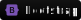

# Welcome aboard  💫 ✨

### 👨‍💻 About me

[Freelance web developer](https://www.revine.fr) self-taught since 2017, I was mostly working with PHP et Laravel and I recently gratuated from Le Réacteur to become Web and Mobile App Full Stack Developer specialized in JavaScript in 2021.

### 💻 Technologies

📩 Feel free to contact me on [Linkedin](https://www.linkedin.com/in/remi-vinatier/) - [Revine](https://www.revine.fr)
